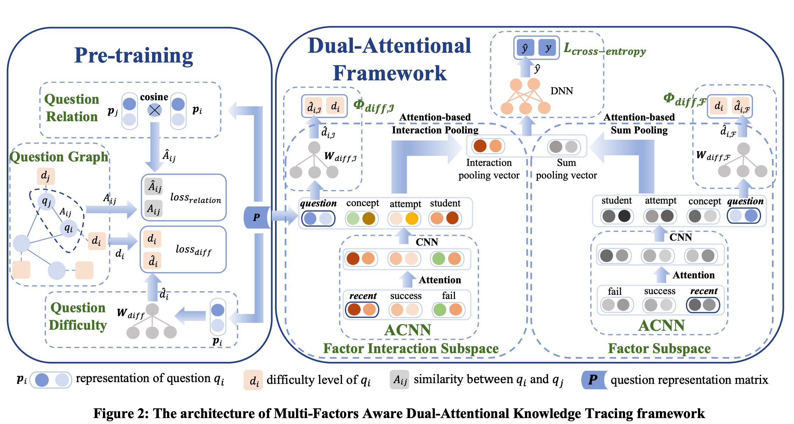

### 其他模型的不足以及MF-DAKT的改进
MF-DAKT主要针对以往的因子模型的不足进行改进
- 前人没有突出近期相关练习对当前题目的重要性，仅仅是用学生在相关概念上做的题目作为输入，这忽略了近期的题目可能有更重要的影响
- 前人忽略了问题中蕴含的丰富信息（问题之间的关系、问题的难度）
- 前人没有注意到不同的因子在不同的题目上会有不同的权重 => 使用双向注意力机制建模这种权重

MF-DAKT提出的解决方案
- 提出了一种 student-related factor，recent factor来记录学生在这个概念上近期做过的题目，为了建模「越近期做的题目对学生的影响越大」，使用了 forgetting function来降低相对远的题目的权重。
- 提出了两种信息来刻画问题信息：1、问题之间的关系（相关性）；2、问题的难度（正确率）。前人也提出过建模问题之间的相关性（在当前语境里相关性就是相似性），然而，以往的相关性是二元的，即：如果两个问题涉及的概念存在重合，则相关。MF-DAKT根据两个题目概念重叠数目，提出了一种连续的相关性。此外，即使两个问题拥有类似的概念，其难度也应当是不一样的，因此MF-DAKT把每个问题的正确率作为难度传入模型。
- 使用双向注意力机制去建模不同因子之间的关系。

### MF-DAKT 的模型图

（模型的图还蛮好看的，值得学习)

### 具体的设计
#### 因子
MF-DAKT设计了四个因子：
- Student and Question Factors
使用one-hot对学生和问题编码，$u\in \mathbb{R}^{N_u}, q \in \mathbb{R}^{N_q}$，来表示不同的学生和问题。
- Concept Factor
使用multi-hot去编码一个问题涉及的概念
- Success and Fail Factors
对于学生$u_i$和问题$q_T$，使用两个multi-hot向量$s$和$f$来表示成功和失败的题目。
- Recent Factor
引入了遗忘函数
$$
F(\bigtriangleup t)= e^{-\theta·\bigtriangleup t}
$$
其中$\theta$是可以学习到的参数，用来控制遗忘率。
MF-DAKT对不同的concept使用了不同的遗忘函数。
